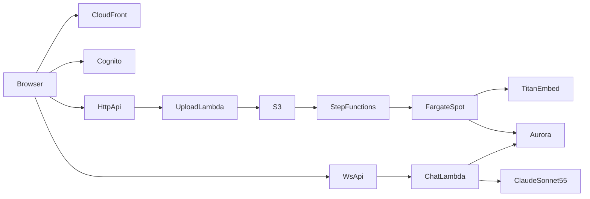

# AWS Claude RAG Chatbot

Serverless web chatbot that answers questions over private PDF knowledge bases using **Claude Sonnet 5.5** on **Amazon Bedrock**, with RAG via **Aurora PostgreSQL Serverless v2 + pgvector**.

## Architecture snapshot

- **Frontend**: React (Vite) on S3 + CloudFront  
- **Auth**: Amazon Cognito (JWT)  
- **APIs**: API Gateway HTTP + WebSocket (WAF rate limits)  
- **Chat**: Lambda → Titan embeddings → pgvector top-k → Claude Sonnet 5.5 (streamed)  
- **Ingest**: S3 upload → EventBridge → Step Functions → **Fargate Spot** (PyMuPDF chunk + embed)  
- **Persistence**: DynamoDB (chats, docs, semantic cache) + Aurora (vectors)  
- **IaC**: Terraform modules under `terraform/`



Full design: [docs/architecture.md](docs/architecture.md) · diagram source: [diagrams/architecture.mmd](diagrams/architecture.mmd)

## Repository layout

```
rag_chatbot/
├── README.md
├── docs/                  # architecture, deployment, cost, security
├── diagrams/              # Mermaid sources
├── terraform/
│   ├── environments/dev/  # root module + tfvars example
│   └── modules/           # networking, storage, data, cognito, compute, api, frontend, observability
├── backend/
│   ├── lambdas/           # TypeScript sources + esbuild bundles (chat, upload, history, connect, disconnect)
│   ├── layers/pg/         # PostgreSQL client layer
│   └── workers/pdf_ingest # Fargate container
└── frontend/              # React chat UI
```

## Quick start

1. Enable Bedrock access for `global.anthropic.claude-sonnet-5-5` and `amazon.titan-embed-text-v2:0`.
2. Build TypeScript Lambdas: `cd backend/lambdas && npm install && npm run build` (see [docs/deployment.md](docs/deployment.md)).
3. `cd terraform/environments/dev && cp terraform.tfvars.example terraform.tfvars && terraform apply`
4. Apply Aurora DDL from `terraform/modules/data/schema.sql`.
5. Build/push the ingest image to ECR.
6. Configure `frontend/.env` from Terraform outputs, `npm run build`, sync to the frontend bucket.

Detailed steps: **[docs/deployment.md](docs/deployment.md)**

## Model configuration

| Role | Model ID |
| --- | --- |
| Chat LLM | `global.anthropic.claude-sonnet-5-5` |
| Embeddings | `amazon.titan-embed-text-v2:0` (1024 dimensions) |

Region default: `us-east-1` (override via Terraform `aws_region`).

## Performance & scale

| Target | Approach |
| --- | --- |
| 100 concurrent users | WebSocket API + reserved chat concurrency |
| <2s typical | TTFT via streaming + semantic cache + HNSW |
| 100MB PDFs | Async Fargate Spot ingest |
| 1000+ documents | Aurora pgvector HNSW |

## Cost target

Designed for **~$130–200/month** at moderate usage. Aurora pgvector is used instead of OpenSearch Serverless to avoid a ~$700 idle floor. See [docs/cost-estimation.md](docs/cost-estimation.md).

## Security

Encryption in transit/at rest (KMS), Cognito JWT auth, least-privilege IAM, WAF rate limiting, CloudTrail + application audit logs. See [docs/security.md](docs/security.md).

## Well-Architected

Mapped explicitly in [docs/architecture.md](docs/architecture.md) across operational excellence, security, reliability, performance efficiency, cost optimization, and sustainability.

## Local UI development

```bash
cd frontend
cp .env.example .env   # fill from terraform output
npm install
npm run dev
```

## License

Sample / practice project — adapt IAM, retention, and compliance controls before production use with sensitive data.
