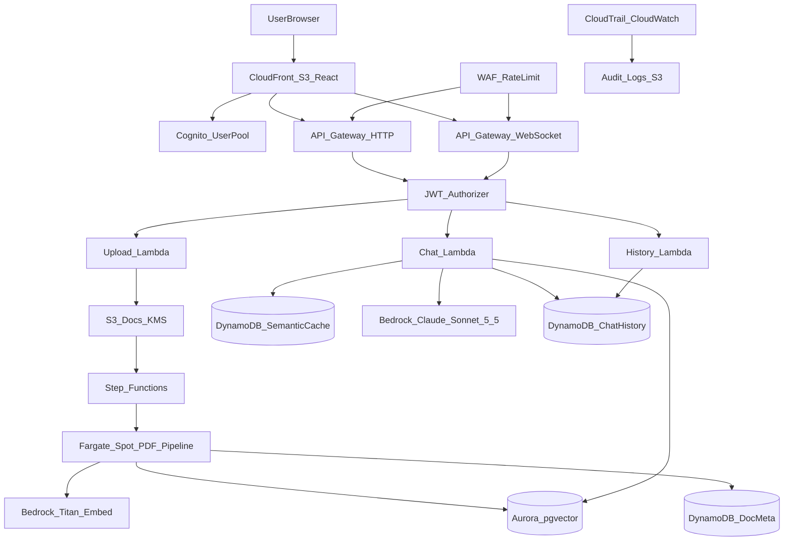
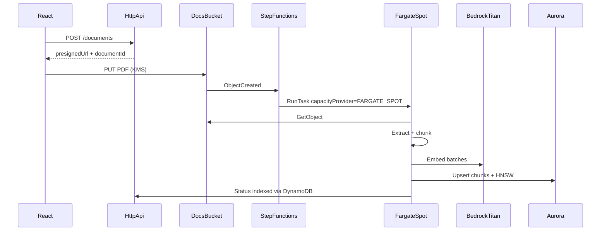
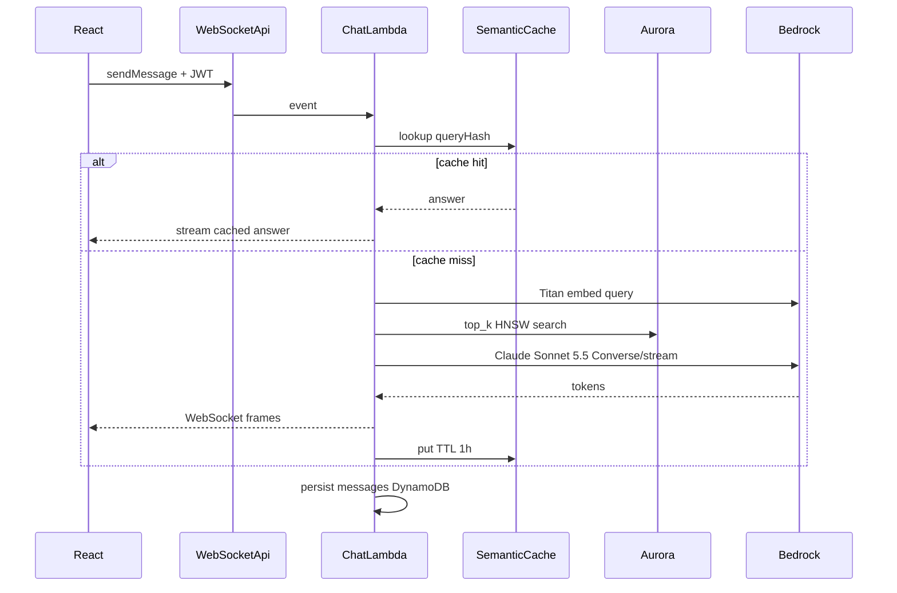

# AWS Claude RAG Chatbot — Solution Architecture

## High-level architecture

The system is a serverless, pay-per-use RAG chatbot on AWS. Users authenticate with Cognito, chat over API Gateway WebSockets, and ask questions grounded in PDFs stored in S3. Retrieval uses Aurora PostgreSQL Serverless v2 with `pgvector`; generation uses Claude Sonnet 5.5 on Amazon Bedrock (`global.anthropic.claude-sonnet-5-5`).

Source diagram: [`diagrams/architecture.mmd`](../diagrams/architecture.mmd).

## Design decisions

| Concern | Choice | Why |
| --- | --- | --- |
| Region | `us-east-1` | Broad Bedrock model availability |
| LLM | `global.anthropic.claude-sonnet-5-5` | Latest Claude Sonnet via global CRIS |
| Embeddings | `amazon.titan-embed-text-v2:0` (1024-dim) | Low cost, Bedrock-native |
| Vector store | Aurora Serverless v2 + pgvector (HNSW) | Meets <$200/mo; OpenSearch Serverless idle floor (~$700) does not |
| Auth | Cognito User Pool + JWT authorizers | Managed sessions, least privilege |
| Realtime | API Gateway WebSocket → Lambda | Serverless streaming chat |
| PDF ingest | S3 → Step Functions → Fargate Spot | Supports ≤100MB PDFs; Spot reduces cost |
| Frontend | React (Vite) on S3 + CloudFront | CDN + pay-per-use |
| Cache | DynamoDB semantic cache + Bedrock prompt caching | Minimize Bedrock spend |

## Component inventory

### Presentation

- **React SPA** (Vite): chat UI, document upload, history sidebar.
- **CloudFront + S3**: HTTPS delivery with Origin Access Control (OAC).
- **Cognito**: email/password (or federated IdP), PKCE for SPA, JWT access tokens.

### API edge

- **API Gateway HTTP API**: `POST /documents`, `GET /documents`, `GET /documents/{id}`, `GET /chats`, `GET /chats/{id}`.
- **API Gateway WebSocket API**: `$connect`, `$disconnect`, `sendMessage`.
- **AWS WAF**: IP rate-based rules attached to both APIs.
- **JWT authorizer**: validates Cognito access tokens on HTTP and WebSocket connect.

### Application compute

| Function / task | Responsibility |
| --- | --- |
| `upload` Lambda | Create document metadata, return KMS-SSE presigned PUT URL |
| `history` Lambda | List/get chat sessions and messages for the authenticated user |
| `chat` Lambda | Semantic cache → embed → retrieve → Claude → stream + persist |
| `connect` / `disconnect` | Track WebSocket connection IDs in DynamoDB |
| `pdf_ingest` Fargate Spot | Extract, chunk, embed, upsert vectors; update document status |

### Data plane

- **S3 (docs)**: PDFs encrypted with CMK (SSE-KMS), versioning, TLS-only bucket policy.
- **Aurora PostgreSQL Serverless v2**: `document_chunks(id, document_id, user_id, content, embedding vector(1024), metadata jsonb)` with HNSW index.
- **DynamoDB tables**:
  - `ChatSessions` / `ChatMessages` — chat persistence
  - `Documents` — upload and indexing status
  - `SemanticCache` — query-hash → answer TTL (1 hour)
  - `WsConnections` — connectionId → userId

### AI services

- **Amazon Bedrock Runtime**: Titan Text Embeddings V2 for query/document vectors; Claude Sonnet 5.5 for grounded answers (streaming preferred).

### Ingestion orchestration

### Chat path

## Data model (logical)

### Aurora `document_chunks`

| Column | Type | Notes |
| --- | --- | --- |
| `id` | UUID | Primary key |
| `document_id` | UUID | Source document |
| `user_id` | TEXT | Owner (Cognito `sub`) |
| `chunk_index` | INT | Order within document |
| `content` | TEXT | Chunk text |
| `embedding` | `vector(1024)` | Titan V2 |
| `metadata` | JSONB | page, source_key, etc. |
| `created_at` | TIMESTAMPTZ | |

Index: `USING hnsw (embedding vector_cosine_ops)`.

### DynamoDB `Documents`

- PK: `userId`, SK: `documentId`
- Attributes: `filename`, `s3Key`, `status` (`pending` \| `processing` \| `indexed` \| `failed`), `sizeBytes`, `createdAt`, `updatedAt`, `error`

### DynamoDB `ChatMessages`

- PK: `sessionId`, SK: `messageId` (ULID/time-sortable)
- GSI `byUser`: `userId` + `createdAt`
- Attributes: `role`, `content`, `citations`, `cacheHit`

## Performance design

| Requirement | Approach |
| --- | --- |
| 100 concurrent users | API Gateway WebSocket scale-out; reserved concurrency on chat Lambda; Aurora scales 0→4 ACU |
| <2s typical response | Target **time-to-first-token (TTFT)** <2s via streaming, cache hits, and HNSW top-k; full completions may exceed 2s for long answers |
| 100MB PDFs | Async Fargate Spot ingest (2 vCPU / 4 GB); chat path never blocked |
| 1000+ documents | HNSW on pgvector; chunked embeddings (~512 tokens, 15% overlap) |

## Reliability

- Step Functions retries + SQS DLQ for failed ingest.
- DynamoDB on-demand for bursty chat writes.
- Multi-AZ Aurora Serverless v2.
- Idempotent chunk upserts keyed by `(document_id, chunk_index)`.
- Lambda timeouts and partial stream error frames to the client.

## Cost optimization

- Prefer Fargate **Spot** for ingest; Aurora `min_capacity = 0` when idle.
- VPC interface/gateway endpoints for S3, DynamoDB, Bedrock, Secrets Manager to reduce NAT.
- Semantic cache + Bedrock prompt caching to cut Claude invocations.
- Reject OpenSearch Serverless for v1 (idle cost floor).

See [cost-estimation.md](./cost-estimation.md).

## AWS Well-Architected mapping

| Pillar | How this design addresses it |
| --- | --- |
| **Operational Excellence** | IaC (Terraform), structured audit logs, CloudWatch alarms (p95 latency, 5xx, Bedrock throttles, Aurora ACU) |
| **Security** | Cognito JWT, least-privilege IAM per function/task, KMS at rest, TLS in transit, WAF rate limits, CloudTrail |
| **Reliability** | Multi-AZ Aurora, async ingest with DLQ, on-demand DynamoDB, retries in Step Functions |
| **Performance Efficiency** | WebSocket streaming, HNSW ANN search, reserved Lambda concurrency, right-sized Fargate for large PDFs |
| **Cost Optimization** | Serverless/pay-per-use, Spot ingest, Aurora scale-to-zero, caching, no OpenSearch Serverless floor |
| **Sustainability** | Scale-to-zero data plane, Spot capacity, CDN caching of static assets |

## Security summary

End-to-end encryption (TLS + KMS), Cognito auth on all APIs, per-user document ownership checks, WAF rate limiting, and CloudTrail + application audit events. Details in [security.md](./security.md).

## Out of scope (v1)

- Multi-tenant org RBAC beyond per-user ownership
- Multi-region active-active
- Cross-account Bedrock model sharing
- Real-time collaborative editing of the knowledge base
